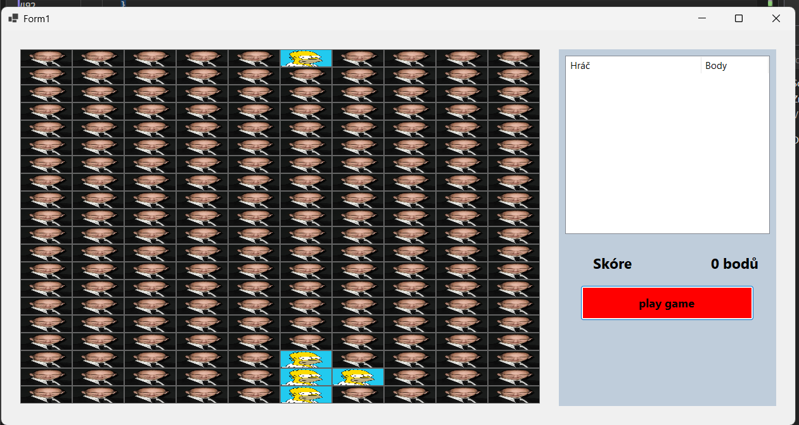

Tetris
Hlavní věci na které jsem se soustředil:
Ve hře  padá zvrchu okna několik  náhodně generovaných tvarů které když jsou v jedné souvislé řadě tak se celá řada odstraní a zapíše se bod.
Hra se začne hrát kliknutím na tlačítko a po dohrání hry vyskočí okno pro zápis přezdívky . Po zapsání  přezdívky okno zmizí a v listView se ukáže přezdívky hráče s jeho body. Listview řadí podle velikosti bodů. 
Snažil jsem se udělat hru responzivní , takže když měním velikost okna tak uprvavuji všechny panely a umístění labelů  atd.

Seznam tříd:
Form1 – hlavní okno aplikace 
Form2 – vyskakovací okno pro zápis přezdívky
Hrac – pro listview ve Form1
TypTvaru – to je jenom enum s výčtem těch tvarů jako kostička křížek elko tyčka atd.

Ovládání:   pohyb do stran je ovládán šipkami a rotace předmětu klávesou r

Metody v form1:
private void CreateGrid()
private void Form1_KeyDown()
private void timer1_Tick()
private void RotujTvar()
private void posuv()
private void ZkontrolujSmazaniRad()
private void OdstranRadu()
private void VykresliAktivniTvar()
private void ZafixujADopln()
private void VyberNovyTvar()
private void kresliHerniPanel()
private void kresliHerniPlochu()
private void Form1_Resize()
private void button1_Click()
private void ResetujHru()
private void listView1_KeyDown()
private void listView1_ItemSelectionChanged()

## Ukázka ze hry

